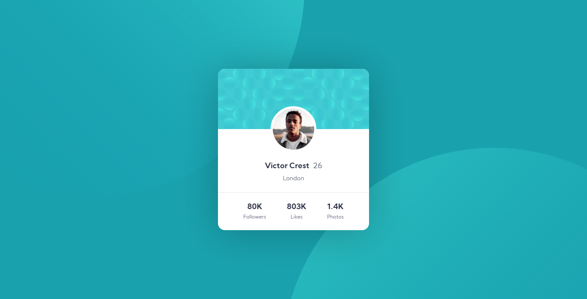
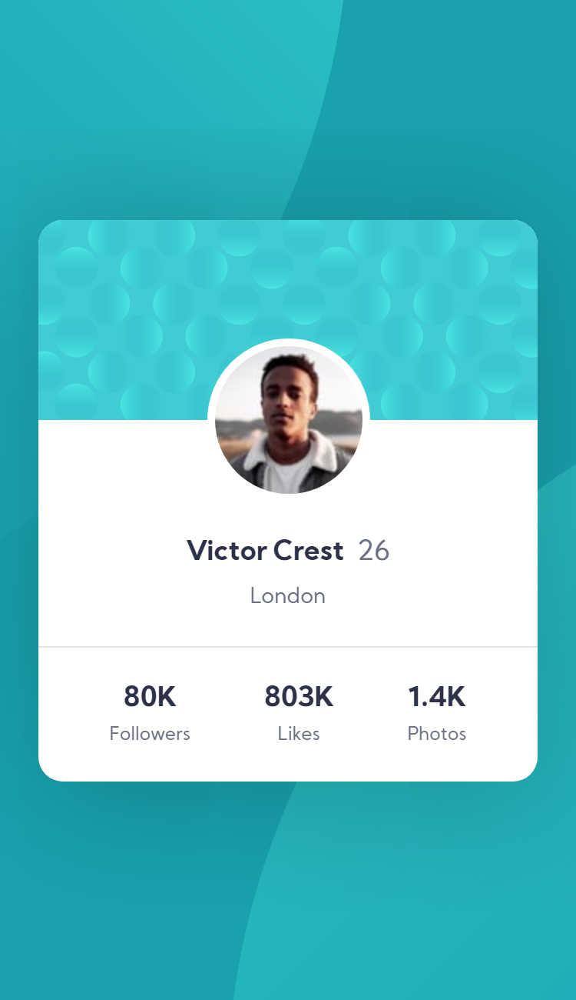

# Profile card component

This is my solution to the [profile card component challenge on Frontend Mentor](https://www.frontendmentor.io/challenges/profile-card-component-cfArpWshJ). I hope you enjoy!

## Contents

- [Overview](#overview)
  - [Challenge](#challenge)
  - [Result](#result)
- [Built with](#built-with)

## Overview

### Challenge

- The challenge offered by the platform was to build the project based on the designs provided.

### Result

#### Desktop

#### Mobile

## Built with

|                                            Technologies and techniques                                             |
| :----------------------------------------------------------------------------------------------------------------: |
|                                         [HTML5](https://devdocs.io/html/)                                          |
|                                          [CSS3](https://devdocs.io/css/)                                           |
|                             [Flexbox](https://devdocs.io/css/css_flexible_box_layout)                              |
| [Mobile-first workflow](https://developer.mozilla.org/en-US/docs/Web/Progressive_web_apps/Responsive/Mobile_first) |

<h4 align="center">
  Challenge completed! :heavy_check_mark:
</h4>
